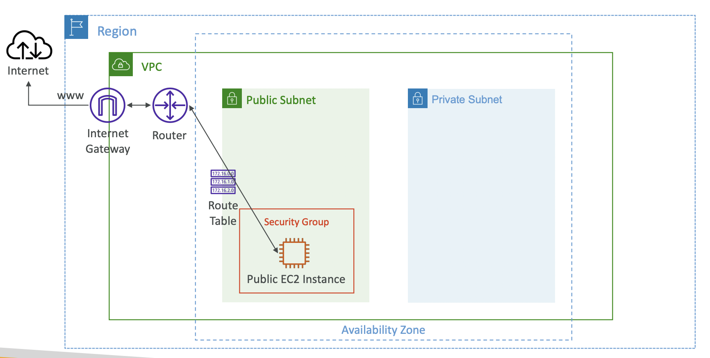

# VPC

In Amazon Web Services (AWS), a VPC stands for Virtual Private Cloud. It is a virtual network environment that allows you to create and manage a logically isolated section of the AWS cloud where you can launch AWS resources like virtual machines (EC2 instances), databases, and other services.

Here are some key characteristics and features of AWS VPC:

1. **Isolation**: A VPC provides network isolation, allowing you to define your own private IP address range, subnets, and route tables. This isolation ensures that resources within one VPC cannot communicate directly with resources in another VPC unless you explicitly configure connectivity.

2. **Customizable Network**: You have control over the IP address range, subnets, and routing within your VPC. This flexibility allows you to design the network to meet your specific requirements.

3. **Security**: You can use security groups and network access control lists (ACLs) to control inbound and outbound traffic to and from resources within the VPC. This provides a robust layer of security for your applications.

4. **Connectivity Options**: AWS VPC offers various connectivity options, including Virtual Private Network (VPN) connections, Direct Connect for dedicated network connections, and AWS Transit Gateway for simplifying VPC connectivity across multiple accounts and regions.

5. **Subnets**: Within a VPC, you can create multiple subnets. Subnets are used to segment your network and can be associated with availability zones for high availability and fault tolerance.

6. **Internet Gateway**: You can attach an internet gateway to your VPC to enable resources within the VPC to access the internet and be accessible from the internet (if configured to do so).

7. **Peering**: VPC peering allows you to connect one VPC to another, enabling resources in different VPCs to communicate with each other.

8. **Security and Compliance**: AWS VPC provides features to help you meet security and compliance requirements. For example, you can use AWS Identity and Access Management (IAM) to control who can create, configure, and manage VPC resources.

9. **Elastic IP Addresses**: You can allocate Elastic IP addresses to resources within your VPC to provide a static public IP address that can be remapped to different instances if needed.

10. **NAT Gateway**: To allow private subnet instances to access the internet for software updates or other purposes, you can set up Network Address Translation (NAT) gateways.

AWS VPC is a fundamental component when setting up infrastructure on AWS, and it plays a crucial role in designing and securing your cloud-based applications and services. It allows you to create a controlled and isolated network environment that suits your organization's requirements.

# CIDR Range

CIDR stands for Classless Inter-Domain Routing. It is a method used for allocating and specifying IP addresses and routing in Internet Protocol (IP) networks. CIDR is a more flexible and efficient way of IP address allocation compared to the older class-based addressing methods.

CIDR notation consists of an IP address followed by a forward slash ("/") and a number, which represents the network prefix length or subnet mask. The network prefix length specifies how many bits of the IP address are used for the network portion, leaving the remaining bits for host addresses. This allows for more granular and efficient IP address allocation.

CIDR notation is made up of two components:

1. **IP Address**: The IP address is the base address for the network or subnet. It specifies the starting point of the network. For example, an IP address might look like "192.168.1.0" or "203.0.113.0."

2. **Prefix Length**: The prefix length is represented by the number following the forward slash ("/"). It indicates how many bits of the IP address are used for the network portion. For example, a prefix length of "/24" means that the first 24 bits of the IP address are used for the network, leaving 8 bits for host addresses.

Here are a few examples of CIDR notation:

- 192.168.1.0/24: This represents a network where the first 24 bits are the network portion, and the last 8 bits are for host addresses.
- 10.0.0.0/16: This specifies a network with a 16-bit network prefix, leaving 16 bits for host addresses.
- 203.0.113.0/28: In this case, the network uses a 28-bit prefix, allowing for a small number of host addresses within the subnet.

CIDR notation allows network administrators to create subnets of varying sizes and efficiently allocate IP addresses based on their specific needs. It replaced the older classful addressing, which divided IP address ranges into fixed classes (Class A, Class B, and Class C) and resulted in inefficient IP address utilization. With CIDR, network addressing is more flexible and scalable, making it a fundamental concept in modern IP networking.

# Private and Public Network

Private and public networks are two distinct types of computer networks that serve different purposes and have varying levels of accessibility and security:

**1. Private Network:**
- A private network is a network that is isolated from the public internet or other public networks.
- It is often used within organizations, homes, or data centers for internal communication and data sharing.
- Private networks are characterized by limited external accessibility, meaning that access to the network is restricted to authorized users or devices.
- Examples of private networks include corporate intranets, local area networks (LANs), and home networks.
- Security measures, such as firewalls, access controls, and encryption, are commonly employed to protect the data and resources within a private network.
- IP addresses within private networks often fall within reserved IP address ranges (e.g., 192.168.0.0/16, 10.0.0.0/8) and are not directly routable on the public internet.

**2. Public Network:**
- A public network is a network that is part of the global internet infrastructure and is accessible by anyone with an internet connection.
- It allows communication and data exchange between devices and users across the internet, including websites, email servers, cloud services, and more.
- Public networks are inherently less secure than private networks because they are open to the public, making security measures like firewalls and encryption crucial for protecting data and privacy.
- IP addresses used on the public internet are unique and globally routable, ensuring that data can be transmitted across the internet to its intended destination.
- Public networks are essential for enabling worldwide connectivity, but users and organizations need to take precautions to safeguard their data and devices when using them.

In summary, private networks are closed, secure networks used for internal communication, while public networks are open networks that form the global internet and allow communication with the outside world. Balancing security and accessibility is crucial when designing and managing both types of networks to meet the specific needs of users and organizations.

# Reserved IP by Private Network
Private networks typically use certain reserved IP address ranges defined by Internet Assigned Numbers Authority (IANA) and can indeed allow only specific values within those ranges. These private IP address ranges are reserved for use within private networks and are not routable over the public internet. The three commonly used private IP address ranges, often referred to as "private network address classes," are:

1. **Class A Private Network**: This range includes IP addresses from 10.0.0.0 to 10.255.255.255. It provides a large number of potential host addresses for large-scale private networks.

2. **Class B Private Network**: The class B private network range is from 172.16.0.0 to 172.31.255.255. It offers a more moderate number of host addresses suitable for medium-sized private networks.

3. **Class C Private Network**: This range encompasses IP addresses from 192.168.0.0 to 192.168.255.255. It is ideal for smaller private networks due to its limited number of available host addresses.

Private networks often use these address ranges to set up internal communication among devices, servers, and other resources without exposing them directly to the public internet. Network administrators can create subnets, assign IP addresses from these ranges, and manage access control within their private networks to ensure that only authorized devices can communicate.

It's important to note that these private IP address ranges are not unique; multiple private networks can use the same address ranges independently without conflict because they are isolated from each other and from the public internet.

*AWS Default  VPC Rance :  172.16.0.0 - 172.31.255.255*

 

# Default VPC
- All new AWS account have a default VPC one in each region.
- New EC2 instance are launched in default VPC if no subnet is specified.
- Default VPC has the internet connectivity and all EC2 inside it have public IPV4 address.
- We also get public and private DNS names.

# VPC in AWS

- You can have multiple VPC in one region (5 max - soft limit)
- Because VPC is private, only private IP are allowed
i.e 10.0.0.0/8, 172.16.0.0/12, 192.168.0.0/16

*Note : Your VPC cidr should not overlap with your other network*

#### Creating Your VPC

 

# VPC – Subnet (IPv4)

- AWS reserves 5 IP addresses (first 4 & last 1) in each subnet
- These 5 IP addresses are not available for use and can’t be assigned to an EC2 instance

*Example: if CIDR block 10.0.0.0/24, then reserved IP addresses are:*
- 10.0.0.0 – Network Address
- 10.0.0.1 – reserved by AWS for the VPC router
- 10.0.0.2 – reserved by AWS for mapping to Amazon-provided DNS
- 10.0.0.3 – reserved by AWS for future use
- 10.0.0.255 – Network Broadcast Address.AWS does not support broadcast in a VPC, therefore the address is reserved.

# Internet Gateway (IGW)
- Allows resources (e.g., EC2 instances) in a VPC connect to the Internet
- It scales horizontally and is highly available and redundant
- Must be created separately from a VPC
- One VPC can only be attached to one IGW and vice versa
- Internet Gateways on their own do not allow Internet access…
- Route tables must also be edited!

# Bastion Host

A bastion host, also known as a jump host, is a server that sits in a public subnet of your network and acts as an intermediary between your trusted network and an external network, typically the internet. It's used to improve security by controlling access to your internal network. Users can SSH or RDP into the bastion host and then use it to connect to other resources within your vpc.

 

# NAT Gateway

A NAT gateway is a Network Address Translation (NAT) service. You can use a NAT gateway so that instances in a private subnet can connect to services outside your VPC but external services cannot initiate a connection with those instances.

 

# NACL

- **Purpose**: NACLs are a network-level firewall in AWS VPCs.
- **Stateless**: They are stateless, meaning inbound and outbound rules must be configured separately.
- **Rule Order**: Rules are evaluated in ascending order based on their rule numbers.
- **Default NACL**: Every VPC has a default NACL that allows all traffic.
- **Inbound and Outbound Rules**: You can create rules for both incoming and outgoing traffic.
- **Rule Types**: Rules are based on IP addresses (CIDR blocks) and port ranges.
- **Use Cases**: NACLs are used for basic network security and segmentation within a VPC.
- **Logging and Monitoring**: AWS provides logging and monitoring for NACLs.
- **Best Practices**: Follow the principle of least privilege and regularly review rules for security. Use in combination with Security Groups for comprehensive security.

